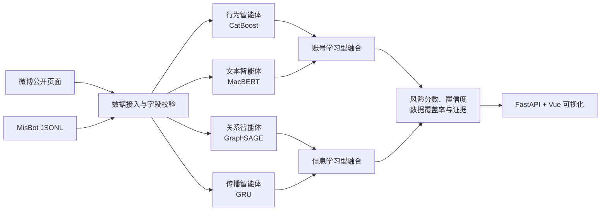

## 基于异构多智能体协同的社交机器人对抗平台

面向微博账号风险识别与异常信息传播辅助研判的人工智能安全竞赛作品。

## 作品简介

社交机器人是由程序自动或半自动控制，能够在社交平台持续执行内容发布、转发和互动等行为的网络账号。此类账号既可用于信息服务，也可能被用于批量操纵传播、放大误导信息、制造虚假热度和干扰公共舆论。传统检测方法通常只分析账号属性、文本内容或传播网络中的单一证据，面对伪装行为、数据缺失和复杂传播场景时，容易出现判断片面、泛化能力不足以及检测结果难以解释等问题。

BotArena 围绕“账号是否具有机器人风险”和“账号传播的信息是否异常”两类任务，构建了行为、文本、关系和传播四个异构智能体。行为智能体采用 CatBoost 分析账号属性与行为统计，文本智能体采用 MacBERT 提取简介及近期发文的上下文语义，关系智能体采用 GraphSAGE 学习互动网络结构，传播智能体采用 GRU 建模互动事件的时间序列。系统进一步综合各智能体的风险概率、置信度和数据覆盖率进行学习型融合，使不同证据能够相互补充，并在数据不完整时给出明确提示。

平台支持 MisBot 数据的离线训练与评测，也能够接入微博公开账号及近期微博进行协同检测。用户输入微博 UID 或公开主页链接后，系统可统一展示账号综合风险、最近微博信息风险、各智能体判断、证据摘要和互动传播图，为分析人员提供可复核的风险线索。当前四个高级模型均已完成训练并接入 `advanced-v2` 运行时；系统定位为辅助研判工具，检测分数不等同于对真实账号身份或信息真伪的最终认定。

> [!IMPORTANT]
> 本项目发布版本及作品报告不包含 MisBot 原始数据集。复现实验时需要自行从 MisBot 原项目获取数据，并遵守相应许可、引用和使用要求。

## 检测方案

BotArena 将检测过程拆分为两条协同链路，并保留可复现的逻辑回归基线：

- 账号检测：CatBoost 行为智能体与 MacBERT 文本智能体分析账号属性、行为统计、简介和近期发文。
- 信息检测：GraphSAGE 关系智能体与 GRU 传播智能体分析参与用户、互动图结构和传播时间序列。
- 协同决策：根据风险分数、模型置信度和数据覆盖率学习融合，不再使用固定权重。

系统采用 FastAPI 提供统一接口，使用 Vue 3、Vite 和 ECharts 构建可视化页面，并输出智能体概率、综合风险分数、风险等级与证据摘要。

## 系统架构



四个智能体通过统一适配层输出概率、置信度和证据。账号与信息融合器分别学习组合各自的两类证据；输入字段不足时，系统同时降低数据覆盖率，避免把缺失信息直接解释为低风险。

## 快速启动

当前目录已经存在 `.venv-gpu`、前端依赖和正式模型时，打开两个 PowerShell 窗口。

窗口一——启动后端：

```powershell
cd F:\BotArena
.\.venv-gpu\Scripts\python.exe -m uvicorn backend.app:app --host 127.0.0.1 --port 8000
```

窗口二——启动前端：

```powershell
cd F:\BotArena\frontend
npm run dev
```

浏览器访问 <http://127.0.0.1:5173>。后端健康检查为 <http://127.0.0.1:8000/api/health>，交互式接口文档为 <http://127.0.0.1:8000/docs>。

## 主要功能

- MisBot JSONL 数据流式读取、字段校验与数据画像。
- CatBoost 账号行为检测与 SHAP 风险证据。
- MacBERT 中文上下文语义检测。
- GraphSAGE 互动关系图检测与 GRU 传播时序检测。
- 四个异构智能体、置信度门控融合和数据覆盖率提示。
- 一次抓取同时完成账号风险与最近微博信息风险检测。
- 无需开放平台令牌的微博公开账号实时抓取与风险分析。
- 微博传播行为表征图，展示目标账号、最近三条微博、互动用户以及发布、评论、转发和点赞关系。
- FastAPI 请求校验、统一响应结构与交互式接口文档。
- 自动化测试覆盖数据解析、特征提取、风险分层和 API 路径。

## 数据集说明

MisBot 数据文件体积较大，其使用与再分发应遵循原项目的许可和说明。需要复现实验的使用者应自行从 [MisBot 开源仓库](https://github.com/whr000001/MisBot) 获取数据，并遵守数据集的使用要求。

下载后请将数据整理到 `data/raw/MisBot/`，核心目录结构如下：

```text
data/raw/MisBot/
├─ User_Instances/
│  ├─ train_data.jsonl
│  ├─ train_data_sampled.jsonl
│  ├─ inference_data.jsonl
│  └─ inference_labels.json
└─ Information_Instances/
   ├─ misinformation.jsonl
   ├─ verified_information.jsonl
   └─ trend_information.jsonl
```


## 技术栈

- Python、NumPy、scikit-learn、CatBoost、PyTorch、Transformers
- FastAPI、Uvicorn、Pydantic
- Vue 3、Vite、ECharts
- JSONL、JSON、joblib 文件化存储

当前高级模型环境已在 Windows、Python 3.11.14、PyTorch 2.7.0 + CUDA 12.6、RTX 4060 Laptop GPU、Node.js 24 和 npm 11 下验证。高级环境建议使用 Python 3.11；本文给出的 Windows PyTorch wheel 不适用于 Python 3.13。

## 项目结构

```text
BotArena/
├─ agents/                 # 多智能体推理与风险融合
├─ backend/                # FastAPI 服务
├─ data/                   # 本地数据目录，原始数据不随仓库发布
├─ experiments/            # 账号与信息模型训练脚本
├─ frontend/               # Vue 可视化前端
├─ models/artifacts/       # joblib、PyTorch 与 MacBERT 正式模型
├─ outputs/                # 数据画像、指标和混淆矩阵
├─ scripts/                # 数据解析、画像和演示脚本
├─ tests/                  # 自动化测试
├─ requirements.txt
├─ requirements-advanced.txt
└─ README.md
```

## 环境准备

以下命令均在项目根目录执行。建议直接创建 Python 3.11 高级环境，它同时覆盖基线、后端和四个高级智能体：

```powershell
py -3.11 -m venv .venv-gpu
.\.venv-gpu\Scripts\Activate.ps1
python -m pip install --upgrade pip
python -m pip install torch==2.7.0 --index-url https://download.pytorch.org/whl/cu126
python -m pip install -r requirements-advanced.txt
```

第四条命令安装适配 NVIDIA 显卡的 CUDA 12.6 构建。如果 PowerShell 禁止执行激活脚本，后续命令可直接使用 `.\.venv-gpu\Scripts\python.exe`，无需修改执行策略。


```powershell
python -m pip install "https://mirrors.aliyun.com/pytorch-wheels/cu126/torch-2.7.0%2Bcu126-cp311-cp311-win_amd64.whl" -i https://mirrors.aliyun.com/pypi/simple
python -m pip install -r requirements-advanced.txt -i https://mirrors.aliyun.com/pypi/simple
```

验证高级依赖与显卡：

```powershell
python -c "import torch, catboost, transformers; print(torch.__version__, torch.cuda.is_available(), torch.cuda.get_device_name(0) if torch.cuda.is_available() else 'CPU')"
```


## 数据检查

确认 MisBot 核心文件完整并生成账号数据画像：

```powershell
python -m scripts.profile_misbot
```

统计三类信息的实例、参与用户、互动动作和传播图规模：

```powershell
python -m scripts.profile_information
```

统计结果分别写入 `outputs/misbot_profile.json` 和 `outputs/information_profile.json`。调试时可使用 `--limit` 或 `--limit-per-category` 限制读取数量。

## 模型文件

完成高级训练后，后端从 `models/artifacts/` 自动加载以下工件：

| 智能体/模块 | 模型 | 文件 |
| --- | --- | --- |
| 行为智能体与账号融合器 | CatBoost + 学习型融合 | `models/artifacts/multiagent_advanced.joblib` |
| 文本智能体 | MacBERT | `models/artifacts/macbert_text/model.safetensors` |
| 关系智能体 | GraphSAGE | `models/artifacts/relation_graphsage.pt` |
| 传播智能体 | GRU | `models/artifacts/propagation_gru.pt` |
| 信息融合器 | 学习型融合 | `models/artifacts/information_agents_advanced.joblib` |

模型文件是二进制工件，训练指标请查看 `outputs/multiagent_advanced_metrics.json` 和 `outputs/information_advanced_metrics.json`。接口结果中的 `model_version` 为 `advanced-v2`，表示高级模型已成功加载；显示 `baseline-v1` 则表示后端回退到了基线模型。

> [!WARNING]
> `models/artifacts/` 和 `outputs/` 默认不会提交到 Git。复制项目到比赛电脑或从 GitHub 重新克隆时，必须单独复制整个 `models/artifacts/`，否则需要重新训练。

## 训练模型

训练可复现的逻辑回归基线：

```powershell
python -m experiments.train_multiagent_baselines
```

训练关系智能体、传播智能体和信息融合模型：

```powershell
python -m experiments.train_information_agents
```

训练 CatBoost、MacBERT 与账号门控融合模型：

```powershell
python -m experiments.train_advanced_accounts
```

默认由 PyTorch 使用可用的 NVIDIA GPU 微调 MacBERT，CatBoost 使用 CPU；如本机 CatBoost CUDA 环境可用，可追加 `--catboost-task-type GPU`。

训练 GraphSAGE、GRU 与信息门控融合模型：

```powershell
python -m experiments.train_advanced_information
```

后端检测到高级工件后自动优先加载；高级工件不存在时继续使用逻辑回归基线，保证基本接口仍可运行。

模型保存到 `models/artifacts/`，评价指标保存到 `outputs/`。高级模型训练完成后，后端即可执行完整的 `advanced-v2` 协同检测。

需要快速验证流程时，可以使用参数限制样本数量：

```powershell
python -m experiments.train_multiagent_baselines --limit 1000
python -m experiments.train_information_agents --limit-per-category 500
python -m experiments.train_advanced_accounts --limit 1000 --epochs 1
python -m experiments.train_advanced_information --limit-per-category 500 --epochs 2
```

限制样本得到的指标仅用于调试，不应替代完整实验结果。

## 启动后端

```powershell
python -m uvicorn backend.app:app --reload --port 8000
```

- 健康检查：<http://127.0.0.1:8000/api/health>
- 接口文档：<http://127.0.0.1:8000/docs>

## 启动前端

另开一个 PowerShell 窗口：

```powershell
cd frontend
npm install
npm run dev
```

页面地址：<http://127.0.0.1:5173>。Vite 会将 `/api` 请求代理到 `http://127.0.0.1:8000`。

前端采用白色展示主题，包含态势总览和微博协同检测。输入一次微博 UID 后，系统抓取公开账号资料与近期博文，同时输出账号风险、最近微博的信息风险及微博传播行为表征图；表征图支持微博全景和发布关系两个模块切换。微博限制匿名访问时支持使用本人登录会话。

### 微博公开账号实时检测

在“微博协同检测”页面输入数字 UID 或包含数字 UID 的公开主页链接，即可抓取公开账号资料和最多 100 条近期博文。账号资料与近期发文交给行为、文本智能体；最近一条公开微博的转评赞计数进入信息检测链路。表征图使用最近三条可访问微博：第一条的评论、转发和点赞每类最多采样 60 个用户，另外两条每类最多采样 20 个用户。任一互动接口采样失败都不会中断账号检测，页面会通过各类实际用户数和数据覆盖率提示信息证据是否充分。程序先尝试匿名公开页面；如果微博返回 HTTP 432，可在启动后端前临时设置本人浏览器登录会话的 Cookie：

```powershell
$env:WEIBO_COOKIE = "Cookie"
python -m uvicorn backend.app:app --reload --port 8000
```

Cookie 只从后端环境变量读取，不通过前端提交，也不要写入代码或提交到仓库。该功能不绕过登录、验证码或访问频率限制；页面结构或访问策略变化时可能暂时不可用。系统不会将抓取到的原始博文写入本地文件。

## 推荐演示流程

1. 打开“态势总览”，说明四个异构智能体及正式测试集 ROC-AUC。
2. 进入“微博协同检测”，输入数字 UID 或公开主页链接；可读取 1 至 100 条近期微博，当前页面默认值为 20。
3. 点击“启动账号与信息协同检测”，展示抓取到的账号资料和最近微博。
4. 操作微博传播行为表征图，切换“微博全景、发布关系”，并点击节点展示账号、微博和用户表征。
5. 对比“账号综合风险”和“最近微博信息风险”，重点说明各智能体分数、模型名称、置信度、数据覆盖率与证据摘要。
6. 指出结果中的 `advanced-v2`，证明后端正在加载 CatBoost、MacBERT、GraphSAGE 和 GRU 正式工件。

如果现场微博限制访问，可打开 <http://127.0.0.1:8000/docs>，执行 `GET /api/demo`，使用本地 MisBot 样本展示同一套四智能体推理链路。

## API

| 方法 | 路径 | 作用 |
| --- | --- | --- |
| `GET` | `/api/health` | 检查后端运行状态 |
| `GET` | `/api/metrics` | 读取本地数据画像与模型指标 |
| `POST` | `/api/detect/account` | 执行账号行为与文本协同检测 |
| `POST` | `/api/detect/weibo` | 抓取微博账号和最近微博并执行两类协同检测 |
| `POST` | `/api/detect/information` | 执行关系与传播协同检测 |
| `GET` | `/api/demo` | 使用本地 MisBot 样本运行四智能体演示 |

后端输出结构包括 `target_type`、`target_id`、`risk_score`、`risk_level`、`model_version`、`agent_scores`、`agent_confidence`、`data_coverage`、`agent_models` 和 `evidence`。风险分层规则为：低风险 `< 0.5`，中风险 `0.5 ≤ score < 0.75`，高风险 `≥ 0.75`。

## 命令行演示

模型和 MisBot 数据准备完成后，可直接运行：

```powershell
python -m scripts.run_detection_demo
```

## 自动化测试

```powershell
python -m unittest discover -s tests -v
```

包含 `/api/demo` 的测试需要本地 MisBot 数据和已训练模型。如果只检查服务是否启动，可以访问 `/api/health`。

## 常见问题

| 问题 | 处理方式 |
| --- | --- |
| `pnpm` 无法识别 | 项目不要求 pnpm，在 `frontend` 中执行 `npm install` 和 `npm run dev`。 |
| 微博返回 HTTP 432 | 设置本人登录会话的 `WEIBO_COOKIE` 后重启后端；Cookie 不要提交到仓库。 |
| 结果显示 `baseline-v1` | 检查 `models/artifacts/` 中五项高级工件是否完整，并从项目根目录启动后端。 |
| `ModuleNotFoundError: backend` | 先执行 `cd F:\BotArena`，再运行 Uvicorn。 |
| `torch.cuda.is_available()` 为 `False` | 检查是否安装了 `cu126` wheel、显卡驱动是否正常，以及当前命令是否使用 `.venv-gpu`。 |
| 微博信息覆盖率较低 | 评论或关系数据受页面权限限制；账号检测仍可运行，解读时应同时查看覆盖率。 |

## 基线实验结果

以下结果来自固定随机种子 `20260719` 和 80/20 分层划分：

| 任务 | 测试样本 | Accuracy | F1 | ROC-AUC |
| --- | ---: | ---: | ---: | ---: |
| 账号融合检测 | 9,708 | 0.7137 | 0.6416 | 0.7762 |
| 信息融合检测 | 3,176 | 0.8013 | 0.7689 | 0.8531 |

表中指标对应逻辑回归基线。高级模型指标分别写入 `outputs/multiagent_advanced_metrics.json` 和 `outputs/information_advanced_metrics.json`，前端自动优先展示高级模型结果。任何指标都只描述对应数据划分下的实验表现；系统输出的是辅助研判风险线索，不应被直接用于认定真实账号身份、判定信息真伪或执行自动处置。

## 高级模型实验结果

以下结果由本机在固定随机种子 `20260719` 下完成正式训练得到。账号任务使用 48,536 条活跃账号记录，信息任务使用 15,877 条 `misinformation` 与 `verified_information` 记录；两项任务均按 80%/10%/10% 分层划分训练集、验证集和测试集。

| 任务 | 模型 | 测试样本 | Accuracy | F1 | ROC-AUC |
| --- | --- | ---: | ---: | ---: | ---: |
| 账号行为智能体 | CatBoost | 4,854 | 0.6700 | 0.5780 | 0.7201 |
| 账号文本智能体 | MacBERT | 4,854 | 0.7285 | 0.6395 | 0.7906 |
| 账号协同决策 | 学习型融合 | 4,854 | 0.7237 | 0.5596 | 0.7990 |
| 信息关系智能体 | GraphSAGE | 1,588 | 0.7834 | 0.7511 | 0.8514 |
| 信息传播智能体 | GRU | 1,588 | 0.8293 | 0.8137 | 0.9073 |
| 信息协同决策 | 学习型融合 | 1,588 | 0.8256 | 0.8034 | 0.9034 |

融合模型并不保证每一项阈值指标都高于最佳单智能体；它综合风险概率、智能体置信度和数据覆盖率，重点改善多证据场景下的统一决策与缺失数据适应能力。完整原始指标、Brier 分数和混淆矩阵保存在 `outputs/multiagent_advanced_metrics.json` 与 `outputs/information_advanced_metrics.json`。

## 致谢

本项目的数据适配和实验验证基于 MisBot 公开研究数据。数据集的著作权、许可和引用要求归原作者及原项目所有；使用或发表相关成果时，请按照 MisBot 仓库提供的信息正确引用。
